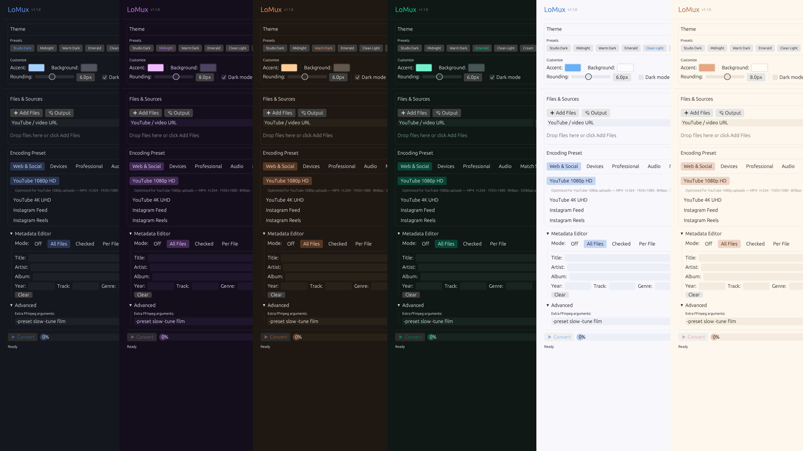

# LoMux

A super lightweight media converter and YouTube downloader that just works. Written in Rust for no reason in particular. (C would've been fine, but here we are, oxidizing perfectly fine Python code.)

<p align="center"></p>

Think Adobe Media Encoder, but free, fast, and under 5MB. No login screen, no Creative Cloud daemon eating your RAM at 3am, no subscription that costs more than your Spotify. Just drag, pick, convert.

## Features

LoMux wraps FFmpeg (and optionally yt-dlp) in a clean native GUI with everything a musician, content creator, or anyone who touches media files actually needs:

**Encoding Presets** — YouTube 1080p/4K, Instagram Feed/Reels, TikTok, Twitter/X, Discord (under 25MB), ProRes 422, DNxHD, plus audio formats like MP3, FLAC, AAC, Opus, WAV. Or go full custom with codec/container/bitrate/CRF control.

**YouTube Integration** — Paste a URL, pick a quality, hit add. Downloads and converts in one pipeline. Temp files clean themselves up.

**Metadata Editing** — Per-file or batch. Title, artist, album, year, genre, track. Smart filename parsing (`Artist - Title.mp3` → fills both fields). Copy metadata across your entire queue with one click.

**Theme System** — Six curated themes (Studio Dark, Midnight, Warm Dark, Emerald, Clean Light, Cream) plus a full editor for accent color, background, rounding, and dark/light mode. Make it yours.

**Batch Processing** — Queue up as many files as you want. Real-time progress. Cancel mid-batch without losing what's already done.

**Drag & Drop** — Drop files directly onto the window. Because it's not 2005.

**Tiny Binary** — 3-5MB vs Electron apps that need 200MB to display a button.

## Install

<details>
<summary><b>macOS (Homebrew)</b></summary>

```bash
brew tap zblauser/tap
brew install lomux
```
This also installs FFmpeg as a dependency.
</details>

<details>
<summary><b>macOS (Binary)</b></summary>

Download from [Releases](https://github.com/zblauser/LoMux/releases). First launch: right-click → Open to bypass Gatekeeper.
</details>

<details>
<summary><b>Linux (.deb)</b></summary>

```bash
# Download the .deb from Releases, then:
sudo dpkg -i lomux_*.deb
sudo apt-get install -f  # resolve dependencies if needed
```
</details>

<details>
<summary><b>Linux (Arch/AUR)</b></summary>

```bash
# Using an AUR helper like yay:
yay -S lomux
```
</details>

<details>
<summary><b>Linux (Binary)</b></summary>

```bash
tar xzf lomux-linux-x64.tar.gz
chmod +x lomux
./lomux
```
</details>

<details>
<summary><b>Windows</b></summary>

Download `lomux-windows-x64.zip` from [Releases](https://github.com/zblauser/LoMux/releases). Extract. Run `lomux.exe`.
</details>

<details>
<summary><b>Build from Source</b></summary>

```bash
git clone https://github.com/zblauser/LoMux.git
cd LoMux
cargo build --release
./target/release/lomux
```
</details>

## Requirements

- **[FFmpeg](https://ffmpeg.org/download.html)** — required. The real MVP.
- **[yt-dlp](https://github.com/yt-dlp/yt-dlp)** — optional, needed for YouTube downloads.

Quick install:
```bash
# macOS
brew install ffmpeg yt-dlp

# Debian/Ubuntu
sudo apt install ffmpeg && pip install yt-dlp

# Arch
sudo pacman -S ffmpeg yt-dlp

# Windows (Chocolatey)
choco install ffmpeg yt-dlp
```

## Why Not Just Use FFmpeg?

Because `ffmpeg -i input.mp4 -c:v libx264 -crf 23 -preset medium -pix_fmt yuv420p -movflags +faststart -c:a aac -b:a 192k output.mp4` is a lot to type when you just want to convert a video. I read the documentation so you don't have to.

## Why Rust?

No certain reason, I was bored. You're getting free conversion software. Could've written this in C? Sure, and maybe I should have. Did I? No. Will it matter to you? Probably not. The binary is small, it's fast, it doesn't crash, and it doesn't need a runtime.

## Changelog

### v1.1.0 (Current)
- Theme system with 6 curated themes + custom editor
- Drag & drop file support
- Cancel/stop processing (actually works now)
- New presets: Instagram Reels, Twitter/X, Discord, Web GIF, Apple TV 4K, Chromecast, Archive H.265, Opus, WAV, Remux
- Fixed FFmpeg progress tracking (was reading wrong pipe)
- Fixed extra arguments not being passed to FFmpeg
- Output file conflict handling (no more silent overwrites)
- Homebrew tap, .deb package, AUR support
- Cleaner UI with accent-colored interactive elements

<details>
<summary><b>Previous Versions</b></summary>

**v1.0.2**
- YouTube integration with format selection
- Metadata editing system (per-file and batch)
- Adobe-style encoding presets
- Dark/light theme toggle
- Tool detection improvements

**v1.0.1**
- Complete rewrite from Python to Rust
- Binary went from 50MB to 3MB
- Native speed, responsive UI

**v1.0.0**
- Original Python/Tkinter version
- Worked fine but built like a potato
- [Still available](https://github.com/zblauser/LoMux/tree/v1.0.0)
</details>

## Roadmap
- WASM web build (host on GitHub Pages, convert in-browser via ffmpeg.wasm)
- Apple Developer ID signing + notarization
- More presets (Twitch, Vimeo, podcast formats)
- Preset import/export
- Queue reordering

## Contributing

If you share the belief that simplicity empowers creativity, feel free to contribute. Fork, PR, bug report, feature request — all welcome. Ensure your code follows the existing style (tabs, minimal comments, blank lines stay blank). Complaints go to `/dev/null`.

## License

[MIT](LICENSE)
