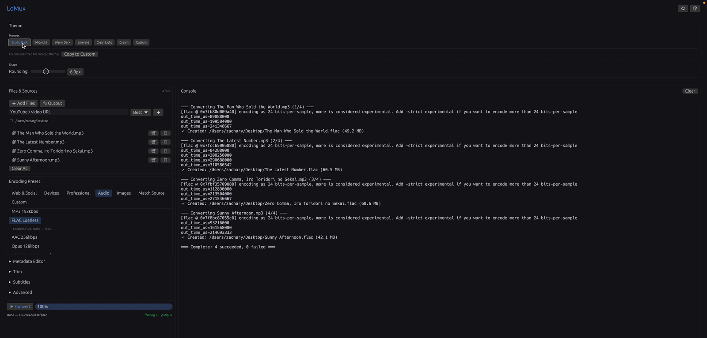
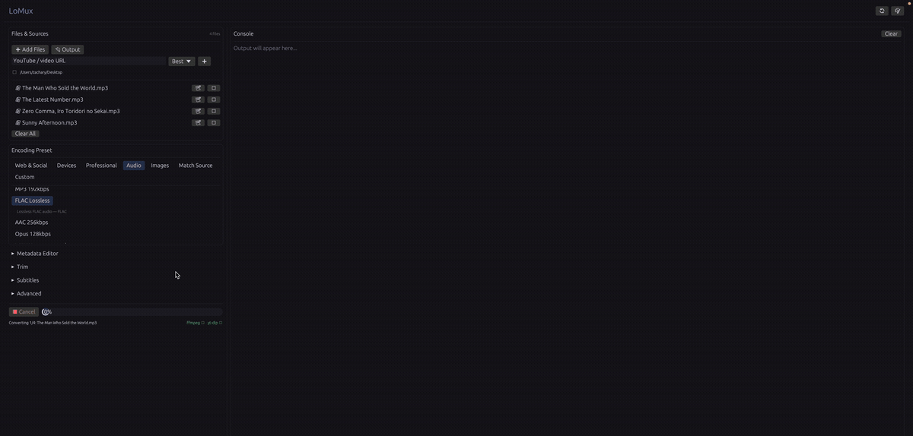

# LoMux

An ultra lightweight media converter and YouTube downloader that just works. Written in Rust for no reason in particular.

<p align="center"></p>

<p align="center"></p>

Think Adobe Media Encoder, but free, fast, and around 6MB. No login screen, no Creative Cloud daemon eating your RAM at 3am, no subscription that costs more than your Spotify. Just drag, pick, convert.

## Features

LoMux wraps FFmpeg (and optionally yt-dlp) in a clean native GUI with everything a musician, content creator, or anyone who touches media files actually needs:

**Encoding Presets**: 54 of them currently.
  - YouTube 1080p/4K/Shorts, Vimeo, Twitch VOD, Instagram Feed/Reels, TikTok, Twitter/X, Facebook/LinkedIn, Discord, WebM VP9.
  - Professional: the full ProRes ladder (Proxy/LT/422/HQ/4444), DNxHR LB/SQ/HQ/HQX, MXF OP1a
  - Audio: MP3, FLAC, AAC, Opus, WAV, AIFF, AC-3, podcast and audiobook mono
  - Full custom with codec/container/bitrate/CRF control.

**Per-Item Presets**: every file in the queue can carry its own preset. One MP4 for the client, one ProRes for the edit, one MP3 for the podcast — same run, one click. Files that override the batch preset say so on their row.

**Images**: PNG/JPEG/TIFF/BMP image sequences from video, single-frame grabs, and straight photo conversion with optional scaling

**Trim**: set in and out points per file (`SS`, `MM:SS`, or `HH:MM:SS`); progress tracks the trimmed range, not the source length.

**Loudness Normalization**: one checkbox, EBU R128 via `loudnorm`

**Subtitles**: burn in or attach as a soft track from any SRT/ASS/VTT file
> [ ! ] Burn-in needs an ffmpeg built with libass; LoMux detects that and tells you instead of failing halfway through

**Two-Pass Encoding**: better quality at the same bitrate for H.264, H.265, VP8, and VP9 presets

**Filename Templating**: `{artist} - {title}`, plus `{name} {album} {year} {genre} {track} {preset} {index} {ext}`

**Preset Import/Export**: share presets as JSON; imported presets persist between sessions.

**YouTube Integration**: Paste a URL, pick a quality, hit add; downloads and converts in one pipeline while temp files clean themselves up

**Metadata Editing**: Per-file or batch; title, artist, album, year, genre, track
  - Smart filename parsing (`artist - title.mp3` -> fills both fields)
  - Copy metadata across your entire queue with one click.

**Theme System**: Six curated themes (Studio Dark, Midnight, Warm Dark, Emerald, Clean Light, Cream) with locked colors, plus a separate custom slot where accent, background, and dark/light are yours to set; rounding is adjustable on any theme

**Batch Processing**: Queue up as many files as you want, real-time progress, cancel mid-batch without losing what's already done.

**Menu Bar**: LoMux / File / View / Help: About with detected tool paths, file and preset actions, panel toggles

**Drag & Drop**: Drop files directly onto the window

**Tiny Binary**: 3-6MB vs Electron apps that need 200MB to display a button

## Install

<details>
<summary><b>macOS (Homebrew)</b></summary>

```bash
brew tap zblauser/tap
brew install lomux
```
This also installs FFmpeg as a dependency.
</details>

<details>
<summary><b>macOS (Binary)</b></summary>

Download `lomux-macos-arm64.tar.gz` (Apple Silicon) or `lomux-macos-intel.tar.gz` from [Releases](https://github.com/zblauser/LoMux/releases). Extract and drag `LoMux.app` to Applications. First launch: right-click → Open to bypass Gatekeeper. A plain `lomux` binary is in the same archive if you'd rather run it from a terminal.
</details>

<details>
<summary><b>Linux (.deb)</b></summary>

```bash
# Download the .deb from Releases, then:
sudo dpkg -i lomux_*.deb
sudo apt-get install -f  # resolve dependencies if needed
```
</details>

<details>
<summary><b>Linux (Arch/AUR)</b></summary>

```bash
# Using an AUR helper like yay:
yay -S lomux
```
</details>

<details>
<summary><b>Linux (Binary)</b></summary>

```bash
tar xzf lomux-linux-x64.tar.gz
chmod +x lomux
./lomux
```
</details>

<details>
<summary><b>Windows</b></summary>

Download `lomux-windows-x64.zip` from [Releases](https://github.com/zblauser/LoMux/releases). Extract. Run `lomux.exe`.
</details>

<details>
<summary><b>Build from Source</b></summary>

```bash
git clone https://github.com/zblauser/LoMux.git
cd LoMux
cargo build --release
./target/release/lomux
```
</details>

## Requirements

- **[FFmpeg](https://ffmpeg.org/download.html)** - required. The real MVP.
- **[yt-dlp](https://github.com/yt-dlp/yt-dlp)** - optional, needed for YouTube downloads.

Quick install:
```bash
# macOS
brew install ffmpeg yt-dlp

# Debian/Ubuntu
sudo apt install ffmpeg && pip install yt-dlp

# Arch
sudo pacman -S ffmpeg yt-dlp

# Windows (Chocolatey)
choco install ffmpeg yt-dlp
```

## Why Not Just Use FFmpeg?

Because `ffmpeg -i input.mp4 -c:v libx264 -crf 23 -preset medium -pix_fmt yuv420p -movflags +faststart -c:a aac -b:a 192k output.mp4` is a lot to type when you just want to convert a video. I read the documentation so you don't have to.

## Why Rust?

No certain reason, I was bored. You're getting free conversion software. Could've written this in C? Sure, and maybe I should have. Did I? No. Will it matter to you? Probably not. The binary is small, it's fast, it doesn't crash, and it doesn't need a runtime.

## Changelog

### v1.3.0 (Current)
**New**
- **Per-item presets.** Pick a preset for the whole queue like always, then override it on any individual file. The row shows which preset it's using, and the file list says "mixed presets" so a batch change never looks like it did nothing.
- The console names the preset it used for each file as it converts, so a mixed batch is readable after the fact

**Fixes**
- `brew install`, the AUR package, and the RPM build were all broken. `Cargo.lock` was gitignored, so it never made it into the release tarball — and all three build with `--locked`, which refuses to run without one. Lockfile is committed now.
- The Homebrew tap had been stuck on v1.1.0 since it was created. The release workflow signed in with a token scoped to this repo, which can't push to the tap repo, and then swallowed the failure and reported success. It now uses a proper token, fails loudly, and refuses to publish a formula it knows won't build.
- The formula it generated claimed GPL-3.0 (MIT since v1.2.0) and shipped a self-test asserting the wrong exit code
- `--version` was hardcoded, so a 1.3.0 build would have cheerfully told you it was 1.2.0
- The Discord preset promised "under 25MB" at a bitrate aimed at nothing in particular. Discord's free cap is 10MB now — the preset actually targets it, about 67 seconds of 720p30.
- Subtitle container warnings checked the batch preset instead of the file you had selected

<details>
<summary><b>Previous Versions</b></summary>

### v1.2.0
**New**
- Image sequences (PNG/JPEG/TIFF/BMP), single-image conversion, and single-frame grabs
- Trim with in/out points per file
- Loudness normalization (EBU R128)
- Subtitles: burn-in and soft-mux, with libass capability detection
- Two-pass VBR encoding
- Output filename templating
- Preset import/export as JSON, persisted between sessions
- 29 new presets: Vimeo, Twitch VOD, YouTube Shorts, Facebook/LinkedIn, WebM VP9, podcast and audiobook audio, AIFF, AC-3, the full ProRes ladder, DNxHR LB/SQ/HQ/HQX, MXF OP1a
- Per-preset audio channel and sample-rate control
- Menu bar (LoMux / File / View / Help) with an About dialog listing detected tools — native system menu on macOS
- macOS builds now ship a proper `LoMux.app` bundle instead of a bare binary

**Fixes**
- Web GIF preset produced an empty file — it stripped video instead of encoding it. Now a proper palette filter chain
- Non-ASCII filenames crashed the app on sight (byte-sliced truncation in a release build that aborts on panic)
- Cancelling or failing an encode left a partial output file behind
- yt-dlp download progress was never wired up — the bar sat at zero for the whole download
- YouTube downloads left temp files behind, and their `yt_<timestamp>_` prefix leaked into output filenames
- `ProRes 422` was silently encoding ProRes 422 **HQ**

**Changes**
- Window title is just "LoMux"; version moved to About
- Curated theme colors are now fixed; customization lives in its own persistent slot
- Licensed under MIT (was GPL-3.0)

### v1.1.0
- Theme system with 6 curated themes + custom editor
- Drag & drop file support
- Cancel/stop processing (actually works now)
- New presets: Instagram Reels, Twitter/X, Discord, Web GIF, Apple TV 4K, Chromecast, Archive H.265, Opus, WAV, Remux
- Fixed FFmpeg progress tracking (was reading wrong pipe)
- Fixed extra arguments not being passed to FFmpeg
- Output file conflict handling (no more silent overwrites)
- Homebrew tap, .deb package, AUR support
- Cleaner UI with accent-colored interactive elements

**v1.0.2**
- YouTube integration with format selection
- Metadata editing system (per-file and batch)
- Adobe-style encoding presets
- Dark/light theme toggle
- Tool detection improvements

**v1.0.1**
- Complete rewrite from Python to Rust
- Binary went from 50MB to 3MB
- Native speed, responsive UI

**v1.0.0**
- Original Python/Tkinter version
- Worked fine but built like a potato
- [Still available](https://github.com/zblauser/LoMux/tree/v1.0.0)
</details>

## Horizon
- Fan-out: one source file producing several outputs in a single run
- Hardware encoding (VideoToolbox, NVENC, QSV, AMF)
- Watch folders
- Subtitle extraction to sidecar files
- Queue reordering
- Apple Developer ID signing + notarization
- WASM web build (host on GitHub Pages, convert in-browser via ffmpeg.wasm)

## Contributing

If you share the belief that simplicity empowers creativity, feel free to contribute. Fork, PR, bug report, feature request — all welcome. Ensure your code follows the existing style, and run `cargo test --release` before opening a PR

