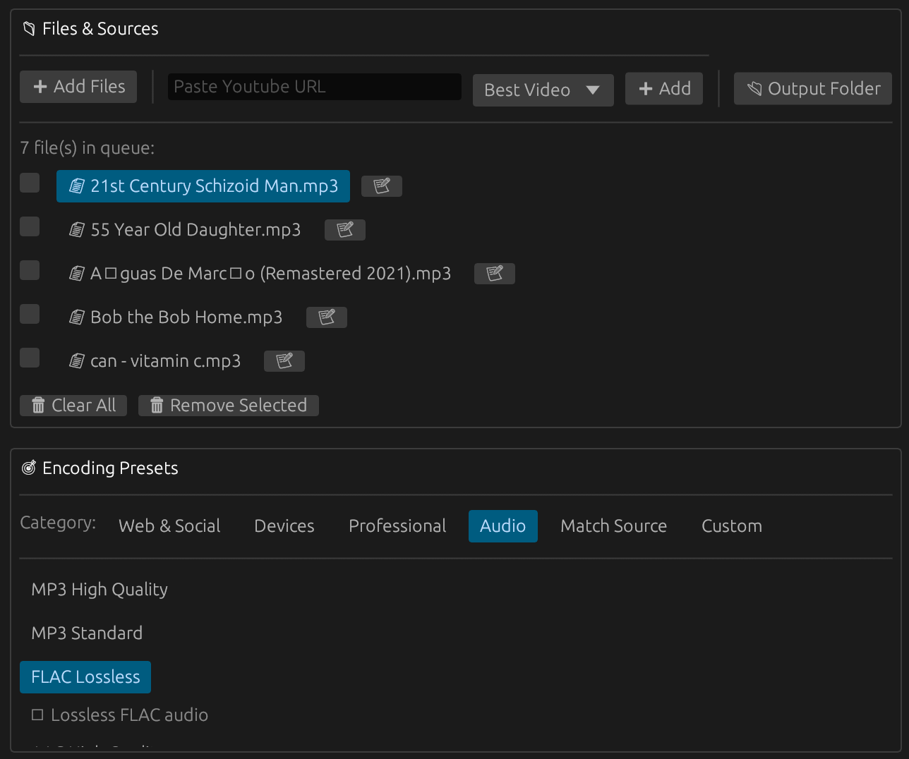
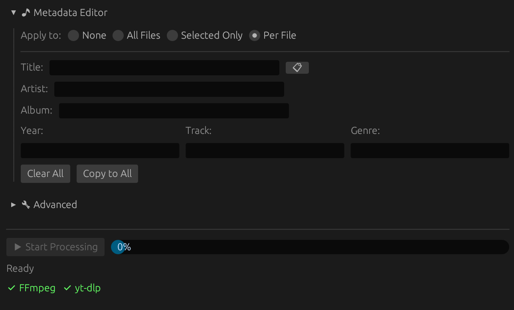

# LoMux
## Overview
A super lightweight media converter and youtube downloader that just works. Written in Rust for no reason in particular. (C would've been fine, but here we are, oxidizing perfectly fine python code. Currently working on a WASM build.

<p align="center"></p>

<table align="center">
	<tr>
		<td align="center">
			<br/>
			[Files & Presets]
        </td>
        <td align="center">
			<br/>
			[Metadata]
		</td>
	</tr>
</table><br>

LoMux converts your media files using FFmpeg (Youtube downloading with yt-dlp), but with a GUI that doesn't look like it was designed in 1993. It's essentially a wrapper for FFMPEG, that runs on less than a fraction of the ram Adobe's media encoder uses. Next part of the process is working on encorperating damn near every use case I can think of under the presets. Not a rust evanglist btw, just a dude trying to apply an idea.<br><br>

- **Current Presets**: Web & Social, Devices, Professional, Audio, Match Source, Custom
- **Batch processing**: Throw multiple files at it
- **Youtube integration**: Download/Convert YT files in one step
- **Metadata editing**: Per batch, or per file
- **Real-time progress**: Actually shows progress (looking at you, Adobe)
- **Tiny binary**: 3-5MB vs Electron apps that somehow need 200MB to display a button

## Run LoMux
<details>
<summary><b>Releases</b></summary>

Download from [Releases](https://github.com/zblauser/LoMux/releases). Pick your OS. Double-click. Done.
</details>

<details>
<summary><b>Build</b></summary>

```bash
git clone https://github.com/zblauser/LoMux.git
cd LoMux
cargo build --release
./target/release/lomux
```

</details>

## Requirements
- [FFMPEG](https://ffmpeg.org/download.html) (the real MVP)
- [yt-dlp](https://github.com/yt-dlp/yt-dlp) (optional, but needed for yt download)

## Why Not Just Use FFmpeg/yt-dlp?
I mean, laziness I suppose. `ffmpeg -i input.mp4 -c:v libx264 -crf 23 -c:a aac -b:a 128k output.mp4` is pretty verbose for non FFMPEG users. I read the documentation so you don't have to. Nevertheless, don't forget to thank them for making it possible.

## Why Rust?
No certain reason, I was bored?.. and you're getting free conversion softeare. Could've written this in C? Sure, and maybe I should have. Did I? No. Will it matter to you? Most of you, probably not.

## Change Log

### v1.0.2 (Latest)<br>
UI Update, and more defined presets
- UI continues to improve, and now has a day/night mode
- You can now download and convert youtube files (via url), and even add them to a batch
- Further defined presets, still reserving the ability to customize
- Edit the meta data of entire batches at once, or per file

<details>
<summary><b>Previous Verions</b></summary>

***v1.0.1***<br>
Complete rewrite, same logic. Yes, I am kind of sarcastically pushing this as a minor release, as aside from the language (the code base wasn't huge), it functions identically, though albiet with a bit of a speed boost.
- Rewrote everything in Rust, because why not
- Binary went from 50MB to 3MB
- Actually runs at native speed now
- UI is 10x more responsive

***v1.0.0***
- Original Python/Tkinter version
- Worked fine but built like a potato
- [Still available](https://github.com/zblauser/LoMux/tree/v1.0.0)

***v0.0.1-v0.0.9***
- Was still messing which GUIs
- Nothing commited, nothing lost.
</details>

## Roadmap
- Enhance preset database
- WASM build
- Host it

## Contributing
If you share the belief that simplicity empowers creativity, feel free to contribute.

#### Contribution is welcome in the form of:
- Forking this repo
- Submitting a Pull Request
- Bug reports and feature requests
Ensure your code follows the existing style.

## Thank you for your attention.
This project started out as self-solving a specific need, and evolved into something I think could actually be useful. If you hit any issues, feel free to open one.
Pull requests, suggestions, and fixes I don't have to make myself are welcome. Complaints go to /dev/null.